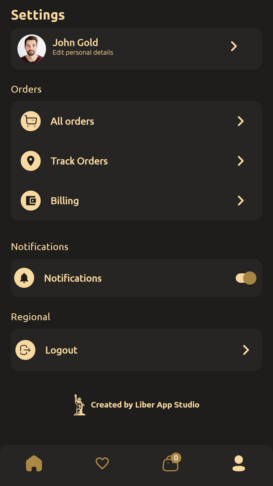
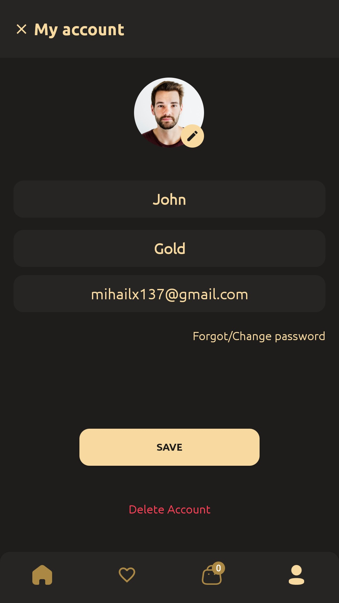
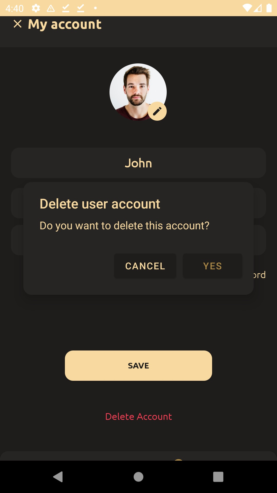

### Requesting Account Deletion for Liber Shop

To request the deletion of your account and associated data for Liber Shop, please follow these steps:

1. Go to your profile tab.

2. Navigate to the "Edit personal details" section.

3. Scroll down to the bottom of the screen.

4. Click on the red "Delete Account" button.

5. Confirm the action by selecting "Yes" when prompted with "Do you want to delete this account?"

For a visual guide, please refer to the screenshots below:

   
  <em>Step 1: Profile Tab</em>

   
  <em>Step 2: Edit Personal Details</em>

   
  <em>Step 3: Delete Account</em>

### Upon account deletion, all associated user data including Name, Surname, Addresses, Email, and Password will be permanently removed from firebase servers.

### For any further assistance or inquiries, please contact our support team at [mihailx136@gmail.com](mailto:mihailx136@gmail.com).
